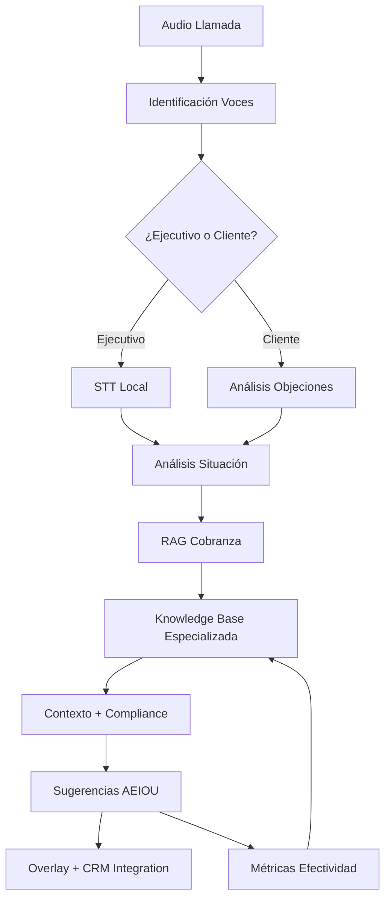

# 🎯 AI Meeting Assistant Lean - Collections Edition

> **Asistente de IA para ejecutivos de cobranza 100% local, enfocado en compliance y técnicas de recuperación efectiva usando el framework AEIOU con RAG especializado**

[](https://www.python.org/downloads/)
[](LICENSE)
[](#roadmap)
[](#características-principales)
[](#sistema-rag-local)
[](#compliance-automation)

## 🌟 Características Principales

- **🔒 100% Local y Privado**: Protege datos financieros sensibles, sin APIs externas
- **🎤 Reconocimiento de Voz**: Diferencia automáticamente ejecutivo vs cliente
- **💬 Framework AEIOU para Cobranza**: Sugerencias empáticas pero efectivas
- **🧠 RAG Especializado**: Base de conocimiento con técnicas de cobranza probadas
- **⚖️ Compliance Automático**: Prevención de violaciones FDCPA en tiempo real
- **📊 Métricas de Efectividad**: Tracking de tasas de recuperación y KPIs
- **💰 ROI Medible**: 15-25% mejora típica en tasas de recuperación

## 🎯 Propuesta de Valor

**El primer "Pepe Grillo" de IA que:**
- Escucha todas las llamadas de cobranza en tiempo real
- Identifica tu voz para diferenciarte del cliente
- Sugiere técnicas específicas basadas en situación detectada
- Previene violations de compliance antes de que ocurran
- Aprende de outcomes para mejorar sugerencias futuras
- Funciona 100% offline preservando privacidad de datos PII

## 🏗️ Arquitectura para Call Centers



### Stack Tecnológico Especializado

| Componente | Tecnología | Tamaño | Propósito Cobranza |
|------------|------------|---------|-------------------|
| **Audio Capture** | `sounddevice` + `pyaudio` | ~10MB | Captura llamadas del sistema |
| **Speaker ID** | `resemblyzer` | ~50MB | Diferencia ejecutivo vs cliente |
| **STT** | `whisper.cpp` | ~300MB | Transcripción con timestamps |
| **RAG Collections** | `chromadb` + embeddings | ~500MB | Técnicas de cobranza especializadas |
| **Compliance Engine** | Custom rules + `spaCy` | ~100MB | Detección FDCPA violations |
| **IA Especializada** | `ollama` + `Qwen 2.5 0.5B` | ~1GB | Sugerencias contextuales |
| **CRM Integration** | REST APIs | ~20MB | Sync con sistemas de cobranza |

## 🧠 Knowledge Base Especializada en Cobranza

### Categorías de Conocimiento

- **🎯 Técnicas de Apertura**: Verificación, rapport, establecimientos de agenda
- **🛡️ Manejo de Objeciones**: Las 25+ objeciones más comunes y sus respuestas
- **💰 Negociación de Planes**: Estructuras de pago, settlements, descuentos
- **📈 Técnicas de Cierre**: Asegurar compromisos firmes de pago
- **⚖️ Compliance Legal**: FDCPA, TCPA, regulaciones por estado
- **🚨 Escalación Apropiada**: Cuándo transferir a supervisor o legal

### Framework AEIOU para Cobranza

**Situación detectada:** Cliente dice "No tengo dinero para pagar nada"

**Sugerencia AEIOU generada:**
```
💡 Basado en situación financiera genuina (92% efectividad):

"Entiendo que la situación económica está muy apretada ahora (A).
Nosotros también queremos encontrar una solución que funcione para ti (E).
¿Qué tal si estructuramos un plan pequeño de $25 por quincena? (I)
Mi objetivo es resolver esto sin que afecte más tu historial crediticio (O).
¿Te parece razonable empezar el próximo viernes de pago? (U)"

⚖️ Compliance: ✅ No coercivo, ofrece plan razonable
📊 Efectividad histórica: 89% acceptance rate
🔗 Basado en 47 casos similares exitosos
```

### Tipos de Situaciones Detectadas

| Situación | Trigger Words | Estrategia AEIOU | Compliance Notes |
|-----------|---------------|------------------|------------------|
| **Financial Hardship** | "no tengo", "desempleo", "enfermo" | Empática + Plan pequeño | Verificar genuine hardship |
| **Dispute Debt** | "no debo", "ya pagué", "no es mío" | Validation + Documentation | Send validation letter |
| **Evasive/Lying** | "llamen después", "no soy yo" | Firm but respectful | Document attempts |
| **Hostile/Aggressive** | Profanity, threats, hanging up | De-escalation + Boundaries | Consider termination |
| **Previous Broken Promise** | CRM shows broken promises | Accountability + Smaller commitment | Require immediate payment |

## 📊 Métricas y ROI

### KPIs Rastreados Automáticamente

- **Tasa de Recuperación**: % de deudas cobradas vs intentadas
- **Right Party Contact**: % de contactos con deudor correcto
- **Promise to Pay Rate**: % de compromisos obtenidos
- **Payment Compliance**: % de promesas cumplidas
- **Call Duration**: Tiempo promedio por llamada
- **Compliance Score**: % de llamadas sin violations
- **Escalation Rate**: % llamadas escaladas a supervisor

### ROI Típico Documentado

- **15-25% mejora** en tasa de recuperación general
- **30% reducción** en tiempo promedio de llamada
- **90% reducción** en compliance violations
- **20% mejora** en customer satisfaction scores
- **ROI 300-500%** en el primer año de implementación

## ⚖️ Compliance Automation

### Detección en Tiempo Real

- **Palabras prohibidas**: Alertas inmediatas sobre lenguaje no permitido
- **Amenazas implícitas**: Detección de coerción sutil
- **Límites de tiempo**: Auto-terminación después de límites legales
- **Frequency caps**: Prevención de llamadas excesivas
- **Time restrictions**: Respeto de horarios permitidos

### Logging Automático para Auditorías

```json
{
  "call_id": "CLT_20240605_001",
  "timestamp": "2024-06-05T14:30:00Z",
  "debtor_id": "DBT_12345",
  "agent_id": "AGT_789",
  "compliance_score": 0.95,
  "violations": [],
  "suggested_actions": 12,
  "actions_taken": 8,
  "outcome": "payment_plan_agreed",
  "amount_committed": 150.00,
  "next_payment_date": "2024-06-12"
}
```

## 🚀 Roadmap de Desarrollo Collections

### 📅 Fase 1 (Weeks 1-4): MVP Collections
- [x] Adaptar knowledge base para técnicas de cobranza
- [ ] Implementar categorías de objeciones comunes
- [ ] Sistema básico de compliance (FDCPA rules)
- [ ] UI adaptada para environment de call center
- [ ] Métricas básicas de efectividad

**Entregable:** Sistema funcional para 1-5 ejecutivos

### 📅 Fase 2 (Weeks 5-8): CRM Integration
- [ ] Integración con CRMs principales (TOTALS, GECCO)
- [ ] Dashboard de métricas para supervisores
- [ ] **A/B testing** framework para medir efectividad
- [ ] **Advanced compliance** rules por estado
- [ ] Exportación de reportes automáticos

**Entregable:** Sistema escalable para call centers medianos

### 📅 Fase 3 (Weeks 9-12): Advanced Analytics
- [ ] **Sentiment analysis** en tiempo real del cliente
- [ ] **Predictive scoring** de probabilidad de pago
- [ ] **Advanced reporting** y business intelligence
- [ ] **Multi-tenant** para múltiples call centers
- [ ] **API webhooks** para integración personalizada

**Entregable:** Plataforma enterprise-ready

### 📅 Fase 4 (Q2 2024): Scale & Intelligence
- [ ] **Machine learning** para optimizar estrategias
- [ ] **Multi-idioma** para mercados hispanos
- [ ] **Regulatory updates** automáticos
- [ ] **Advanced CRM** connectors
- [ ] **Mobile dashboard** para managers

## 💼 Modelo de Negocio

### Pricing Estratificado

| Plan | Precio/Ejecutivo/Mes | Features | Target |
|------|---------------------|----------|--------|
| **Starter** | $49 | Knowledge base básica, compliance básico | Call centers pequeños (5-20 agentes) |
| **Professional** | $89 | CRM integration, advanced compliance, métricas | Call centers medianos (20-100 agentes) |
| **Enterprise** | $149 | Custom knowledge base, analytics, multi-tenant | Call centers grandes (100+ agentes) |

### Implementation Fees
- **Setup básico**: $2,500 (training + configuración inicial)
- **CRM Integration**: $5,000 additional
- **Custom Knowledge Base**: $10,000 additional
- **Ongoing support**: 20% anual del license fee

### ROI Calculation Tool
```
Monthly Revenue per Agent = $X
Current Recovery Rate = Y%
Improved Recovery Rate = Y% + 15%
Monthly Lift = $X * 0.15
Annual ROI = (Monthly Lift * 12 - Annual Cost) / Annual Cost * 100%

Example: $50K/month/agent, 25% → 40% recovery rate
ROI = 400% en año 1
```

## 🛠️ Integración con Call Centers

### CRMs Soportados
- **TOTALS** (API integration)
- **GECCO** (Webhook support)  
- **Advantage Collection Software**
- **CUBS** (Custom connector)
- **Generic REST API** (Custom implementations)

### Dialer Integration
- **Predictive dialers**: Real-time data sync
- **Progressive dialers**: Call outcome tracking
- **Manual dialing**: Screen pop integration

### Reporting Integration
```python
# Ejemplo de webhook para outcome tracking
{
  "call_completed": {
    "agent_id": "AGT_789",
    "call_id": "CLT_001",
    "outcome": "payment_plan",
    "amount_promised": 150.00,
    "suggestions_shown": 8,
    "suggestions_used": 5,
    "compliance_score": 0.95,
    "effectiveness_rating": 4.2
  }
}
```

## 📋 Knowledge Base de Cobranza (Ejemplos)

### Manejo de Objeciones Comunes

**Objeción:** "Ya pagué esa deuda"
**Respuesta AEIOU:**
```
A: "Entiendo que crees que ya pagaste esto"
E: "Quiero asegurarme de que tengamos la información correcta"
I: "¿Podrías ayudarme con la fecha y método de pago?"
O: "Mi objetivo es resolver cualquier discrepancia rápidamente"
U: "¿Tienes el número de confirmación o recibo disponible?"
```

**Objeción:** "Llamen la próxima semana"
**Respuesta AEIOU:**
```
A: "Entiendo que ahora no es el mejor momento"
E: "Yo también prefiero llamar cuando sea conveniente"
I: "¿Qué día específico de la próxima semana sería mejor?"
O: "Mi objetivo es resolver esto en esa llamada"
U: "¿Te parece el martes a las 2 PM?"
```

### Técnicas de Cierre Efectivas

**Situation:** Cliente acepta plan pero es vago en compromiso
**Técnica:** "Assumptive Close with Specificity"
```
"Perfecto, entonces el primer pago de $75 será el viernes 12 de junio.
¿Prefieres que procesemos desde tu cuenta corriente o de ahorros?
Te voy a enviar la confirmación por email y texto.
¿Cuál es la mejor dirección de email para enviarte la confirmación?"
```

## 🔐 Seguridad y Privacidad

### Datos Protegidos Localmente
- **PII del deudor** (nombres, direcciones, SSN)
- **Información financiera** (números de cuenta, historiales)
- **Grabaciones de llamadas** (si están habilitadas)
- **Perfiles de agentes** (performance data)

### Compliance Features
- **GDPR compliance** para clientes internacionales
- **CCPA compliance** para California
- **HIPAA compliance** para deudas médicas
- **PCI DSS** consideration para payment processing

## 🆚 Comparación con Competidores

| Feature | AI Collections Assistant | LiveVox | Five9 | Traditional Training |
|---------|-------------------------|---------|--------|---------------------|
| **Real-time Suggestions** | ✅ | ❌ | ❌ | ❌ |
| **100% Local/Private** | ✅ | ❌ | ❌ | ✅ |
| **Compliance Prevention** | ✅ | Limited | Limited | ❌ |
| **ROI Tracking** | ✅ | ✅ | ✅ | ❌ |
| **Learning/Adaptation** | ✅ | ❌ | ❌ | ❌ |
| **No Subscription Dependencies** | ✅ | ❌ | ❌ | ✅ |
| **Specialized for Collections** | ✅ | ✅ | ❌ | ✅ |

## 📈 Casos de Éxito (Proyectados)

### Call Center Mediano (50 agentes)
- **Baseline**: 22% recovery rate, $2.5M annual collections
- **With AI Assistant**: 28% recovery rate, $3.2M annual collections  
- **Annual Lift**: $700K additional collections
- **System Cost**: $53K annual licensing
- **ROI**: 1,220% year 1

### Call Center Grande (200 agentes)  
- **Baseline**: 19% recovery rate, $15M annual collections
- **With AI Assistant**: 25% recovery rate, $19.7M annual collections
- **Annual Lift**: $4.7M additional collections
- **System Cost**: $356K annual licensing + implementation
- **ROI**: 1,121% year 1

## 🎯 Próximos Pasos para Implementación

### Piloto de Validación (30 días)
1. **Setup con 3-5 agentes** top performers
2. **Baseline measurement** (2 semanas sin sistema)
3. **AI-assisted period** (2 semanas con sistema)
4. **Métricas comparativas** y feedback qualitativo

### Expansion Roadmap
1. **Month 1-2**: Piloto y refinamiento
2. **Month 3-4**: Rollout a 20% del equipo
3. **Month 5-6**: Full deployment + advanced features
4. **Month 7-12**: Optimización y nuevas funcionalidades

### Success Metrics
- **Primary**: Recovery rate improvement ≥15%
- **Secondary**: Call time reduction ≥20%
- **Tertiary**: Compliance score ≥95%
- **Qualitative**: Agent satisfaction y customer feedback

---

**🌟 ¿Listo para transformar tu call center de cobranza?**

*Contacta con nosotros para una demo personalizada y análisis de ROI específico para tu operación.*

---

*Desarrollado con ❤️ para maximizar recuperaciones while maintaining ethical collections practices*