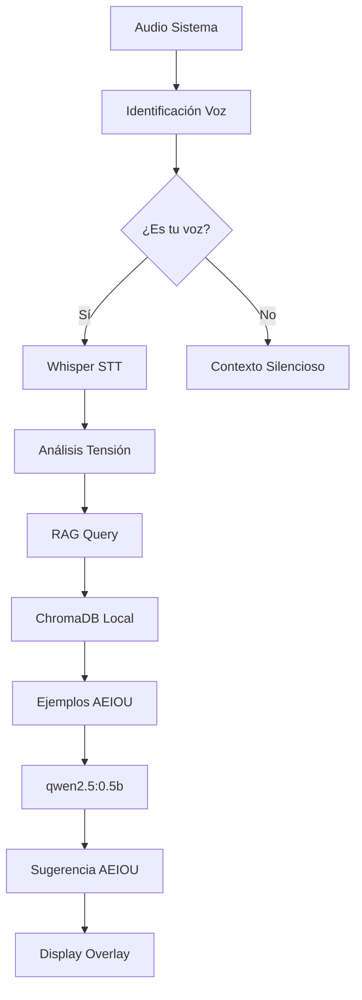

# 🎯 AI Meeting Assistant Lean

> **Asistente de IA para reuniones 100% local, diseñado para desarrollo lean. Captura audio del sistema, identifica tu voz y genera sugerencias AEIOU sin unirse a reuniones.**

[](https://www.python.org/downloads/)
[](LICENSE)
[](#quick-start)
[](#características-principales)

## 🌟 Características Principales

- **🔒 100% Local y Privado**: Todo funciona offline, sin APIs externas
- **🎤 Audio del Sistema**: Captura audio sin unirse a reuniones
- **👤 Identificación Personal**: Diferencia automáticamente tu voz con IA
- **💬 Framework AEIOU**: Sugerencias de comunicación no-violenta
- **🧠 RAG Local**: Base de conocimiento contextual con ChromaDB
- **⚡ Sin GPU**: Optimizado para CPUs estándar (4GB RAM)
- **🚀 Desarrollo Lean**: Setup en 15 minutos, arquitectura simple

## 🎯 Propuesta de Valor

**El primer asistente de IA que:**
- Escucha reuniones desde tu escritorio sin integraciones complejas
- Identifica tu perfil de voz para diferenciarte de otros participantes
- Genera sugerencias AEIOU contextuales usando una base de conocimiento local
- Funciona completamente offline preservando tu privacidad total
- Se instala y configura en menos de 15 minutos

## 🚀 Quick Start

### Instalación Automática (Recomendada)

```bash
# 1. Clonar repositorio
git clone https://github.com/reyer3/ai-meeting-assistant-lean.git
cd ai-meeting-assistant-lean

# 2. Ejecutar instalador automático
python scripts/install_lean.py
```

El instalador configurará automáticamente:
- ✅ Dependencias de Python
- ✅ Ollama + modelo qwen2.5:0.5b
- ✅ Base de conocimiento AEIOU
- ✅ Perfil de voz personal (interactivo)

### Uso Inmediato

```bash
# Iniciar asistente
python src/main.py

# O usar scripts de inicio
./start_lean.sh      # Linux/Mac
start_lean.bat       # Windows
```

## 🏗️ Arquitectura Lean



### Stack Tecnológico Lean

| Componente | Tecnología | Tamaño | Propósito |
|------------|------------|--------|-----------|
| **Audio Capture** | `sounddevice` + OS APIs | ~10MB | Captura audio del sistema |
| **Speaker ID** | Embeddings simples | ~50KB | Identificación de voz personal |
| **STT** | `whisper base` | ~74MB | Transcripción local rápida |
| **IA** | `qwen2.5:0.5b` | ~316MB | Generación AEIOU sin GPU |
| **RAG** | `chromadb` local | ~200MB | Base conocimiento contextual |
| **UI** | Console + futuro overlay | Built-in | Interface no intrusiva |
| **Total** | | **~650MB** | **Sistema completo** |

## 🧠 Sistema RAG Local

### Base de Conocimiento Incluida

- **📚 10+ Ejemplos AEIOU**: Situaciones reales de reuniones
- **🎯 Categorías**: Conflictos técnicos, deadlines, comunicación, recursos
- **💼 Contextos**: Por tipo de reunión, urgencia y tamaño de equipo
- **🗣️ Efectividad**: Métricas de éxito por situación
- **📊 Aprendizaje**: Mejora continua basada en feedback

### Categorías de Situaciones

| Categoría | Ejemplos | Uso |
|-----------|----------|-----|
| **Conflictos Técnicos** | Desacuerdos sobre implementación | Respuestas objetivas |
| **Presión de Deadlines** | Fechas imposibles, extensiones | Priorización y negociación |
| **Comunicación** | Malentendidos, interrupciones | Clarificación activa |
| **Recursos** | Falta presupuesto/personal | Alternativas viables |
| **Feedback Difícil** | Críticas, cuestionamientos | Marcos constructivos |

## 💡 Framework AEIOU

### Estructura de Respuestas

Cada sugerencia sigue el framework AEIOU:

- **A (Acknowledge)**: "Entiendo que tienes preocupaciones sobre..."
- **E (Express)**: "Yo también quiero asegurarme de que..."
- **I (Identify)**: "¿Podríamos explorar la opción de...?"
- **O (Outcome)**: "Mi objetivo es que lleguemos a..."
- **U (Understanding)**: "¿Qué opinas de esta propuesta?"

### Ejemplo en Acción

**Situación detectada**: "No estoy de acuerdo con esta implementación"

**Sugerencia AEIOU generada**:
```
💡 Entiendo que tienes reservas sobre este enfoque (A). 
Yo también quiero asegurarme de elegir la mejor solución (E). 
¿Podríamos revisar las alternativas que tienes en mente? (I) 
Mi objetivo es que lleguemos a una decisión técnica sólida (O). 
¿Qué aspectos específicos te preocupan más? (U)

📊 Basado en 3 situaciones similares | 🎯 Efectividad: 89%
```

## 📋 Instalación Manual

### Requerimientos del Sistema

- **SO**: Windows 10+, macOS 10.15+, Ubuntu 20.04+
- **Python**: 3.8+ (recomendado 3.11)
- **RAM**: 6GB mínimo (8GB recomendado)
- **CPU**: Intel i5 2018+ o AMD Ryzen equivalente
- **Storage**: 3GB espacio libre
- **Audio**: Dispositivo de captura activo

### Pasos Manuales

#### 1. Dependencias Python

```bash
pip install -r requirements.txt
```

#### 2. Ollama + Modelo

```bash
# Instalar Ollama
# Windows/Mac: https://ollama.ai/download
# Linux: curl -fsSL https://ollama.ai/install.sh | sh

# Descargar modelo
ollama pull qwen2.5:0.5b
```

#### 3. Base de Conocimiento

```bash
python scripts/setup_knowledge_base.py
```

#### 4. Perfil de Voz

```bash
python scripts/setup_voice_profile.py
```

#### 5. Configuración de Audio

**Windows**:
1. Panel de Control > Sonido > Grabación
2. Click derecho > "Mostrar dispositivos deshabilitados"
3. Habilitar "Mezcla estéreo" o "Stereo Mix"

**macOS**:
1. Instalar [BlackHole](https://github.com/ExistentialAudio/BlackHole)
2. Configurar como dispositivo de entrada

**Linux**:
```bash
pactl load-module module-loopback
```

## 🎯 Performance Targets

| Métrica | Target | Medición |
|---------|--------|----------|
| Identificación voz | <100ms | Embedding + similitud |
| Whisper STT | <2s | Audio 3s → texto |
| RAG Query | <200ms | ChromaDB búsqueda |
| Generación IA | <3s | qwen2.5 respuesta |
| **Latencia total** | **<6s** | Audio → Sugerencia |

## 🔧 Configuración Avanzada

### Ajuste de Sensibilidad

```python
# En src/lean_pipeline.py
config = ProcessingConfig(
    voice_threshold=0.65,        # Sensibilidad de voz (0.5-0.9)
    min_suggestion_interval=8.0,  # Frecuencia sugerencias
    similarity_threshold=0.7,     # Umbral RAG
    temperature=0.2               # Creatividad IA
)
```

### Modelos Alternativos

| Modelo | Tamaño | Velocidad | Calidad | Uso |
|--------|--------|-----------|---------|-----|
| `qwen2.5:0.5b` | 316MB | ⚡⚡⚡ | ⭐⭐ | **Recomendado** |
| `qwen2.5:1.5b` | 934MB | ⚡⚡ | ⭐⭐⭐ | Mejor calidad |
| `llama3.2:1b` | 1.3GB | ⚡ | ⭐⭐⭐ | Máxima calidad |

## 🐛 Troubleshooting

### Problemas Comunes

**"No se detecta audio"**
```bash
# Test dispositivos
python src/audio/system_capture.py
```

**"Ollama no conecta"**
```bash
# Verificar servicio
ollama serve
ollama list
```

**"Perfil de voz falló"**
```bash
# Recrear perfil
rm data/user_voice_profile.pkl
python scripts/setup_voice_profile.py
```

**"ChromaDB error"**
```bash
# Limpiar y recrear
rm -rf data/chroma_db
python scripts/setup_knowledge_base.py
```

### Logs y Debugging

```bash
# Ver logs en tiempo real
tail -f logs/lean_assistant.log

# Test individual de componentes
python src/audio/lean_speaker_id.py
python src/ai/lean_stt.py  
python src/ai/lean_llm.py
```

## 🆚 Comparación con Alternativas

| Feature | AI Assistant Lean | Otter.ai | Grain | Krisp |
|---------|-------------------|----------|--------|-------|
| **100% Local** | ✅ | ❌ | ❌ | ❌ |
| **Sin Suscripción** | ✅ | ❌ | ❌ | ❌ |
| **AEIOU Framework** | ✅ | ❌ | ❌ | ❌ |
| **Audio Sistema** | ✅ | ❌ | ❌ | ✅ |
| **RAG Local** | ✅ | ❌ | ❌ | ❌ |
| **Setup < 15min** | ✅ | ✅ | ✅ | ✅ |

## 🗺️ Roadmap

### ✅ v1.0 - Lean MVP (Actual)
- [x] Captura audio del sistema
- [x] Identificación de voz personal
- [x] STT local con Whisper
- [x] LLM local sin GPU
- [x] RAG con ChromaDB
- [x] Framework AEIOU
- [x] Instalación automatizada

### 🔄 v1.1 - UX Improvements
- [ ] Overlay UI system-wide
- [ ] Configuración gráfica
- [ ] Métricas de efectividad
- [ ] Temas y personalización

### 🚀 v1.2 - Advanced Features
- [ ] Múltiples idiomas
- [ ] Integración con calendarios
- [ ] Export de sugerencias
- [ ] Plugin arquitectura

### 💫 v2.0 - Intelligence
- [ ] Aprendizaje de patrones personales
- [ ] Análisis de dinámicas de equipo
- [ ] Sugerencias predictivas
- [ ] Dashboard de comunicación

## 🤝 Contributing

### Setup para Desarrollo

```bash
# Clonar y setup
git clone https://github.com/reyer3/ai-meeting-assistant-lean.git
cd ai-meeting-assistant-lean
python -m venv venv
source venv/bin/activate
pip install -r requirements.txt

# Ejecutar tests
python -m pytest tests/

# Formato código
black src/
flake8 src/
```

### Áreas de Contribución

- 🎨 **UI/UX**: Overlay interface, configuración visual
- 🧠 **AI/ML**: Mejoras en modelos, optimización de embeddings
- 🔊 **Audio**: Soporte multiplataforma, reducción ruido
- 📚 **Knowledge**: Más ejemplos AEIOU, categorías
- 🌐 **i18n**: Soporte para múltiples idiomas
- 📖 **Docs**: Tutoriales, ejemplos, videos

## 📄 Licencia

Este proyecto está bajo la Licencia MIT - ver [LICENSE](LICENSE) para detalles.

## 🙏 Agradecimientos

- **OpenAI** - Whisper STT de alta calidad
- **Alibaba** - Modelo Qwen2.5 eficiente
- **ChromaDB** - Base de datos vectorial local
- **Ollama** - Runtime local para LLMs
- **Framework AEIOU** - Metodología de comunicación no-violenta

---

**⭐ Si este proyecto te resulta útil, considera darle una estrella en GitHub!**

---

*Desarrollado con ❤️ para mejorar la comunicación en equipos usando IA local*
