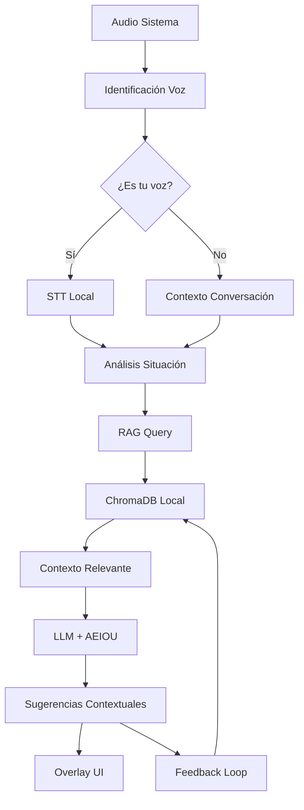

# 🎯 AI Meeting Assistant Lean

> **Asistente de IA para reuniones 100% local, enfocado en privacidad y comunicación no-violenta usando el framework AEIOU con RAG local**

[](https://www.python.org/downloads/)
[](LICENSE)
[](#roadmap)
[](#características-principales)
[](#sistema-rag-local)

## 🌟 Características Principales

- **🔒 100% Local y Privado**: Todo funciona offline, sin APIs externas
- **🎤 Reconocimiento de Voz Personal**: Diferencia automáticamente tu voz de otros participantes
- **💬 Framework AEIOU**: Sugerencias especializadas en comunicación no-violenta
- **🧠 RAG Local**: Base de conocimiento contextual con ChromaDB
- **⚡ Sin GPU Requerida**: Optimizado para CPUs estándar (4GB RAM)
- **🚀 Desarrollo Lean**: MVP en 4 semanas, arquitectura simple y efectiva
- **💰 Costo Cero**: Sin suscripciones, sin APIs pagadas, compra única

## 🎯 Propuesta de Valor

**El primer asistente de IA que:**
- Escucha todas las reuniones sin necesidad de integrarse a plataformas específicas
- Identifica tu perfil de voz pregrabado para diferenciarte de otros hablantes
- Usa una base de conocimiento local para generar sugerencias AEIOU contextuales
- Aprende de conversaciones exitosas para mejorar sugerencias futuras
- Funciona completamente offline preservando tu privacidad total

## 🏗️ Arquitectura Técnica



### Stack Tecnológico

| Componente | Tecnología | Tamaño | Propósito |
|------------|------------|---------|-----------|
| **Audio Capture** | `sounddevice` + `numpy` | ~10MB | Captura audio del sistema |
| **Speaker ID** | `resemblyzer` | ~50MB | Identificación de voz personal |
| **STT** | `whisper.cpp` | ~300MB | Transcripción local |
| **RAG Database** | `chromadb` + embeddings locales | ~200MB | Base de conocimiento contextual |
| **Embeddings** | `sentence-transformers` (local) | ~500MB | Vectorización para RAG |
| **IA** | `ollama` + `Qwen 2.5 0.5B` | ~1GB | Generación de sugerencias |
| **UI** | `tkinter` / `PyQt6` | Built-in | Overlay system-wide |

## 🧠 Sistema RAG Local

### Base de Conocimiento Incluida

El sistema viene con una base de conocimiento pre-poblada con:

- **📚 Biblioteca AEIOU**: 500+ ejemplos de respuestas efectivas categorizadas
- **🎯 Situaciones Comunes**: Patrones de conflicto frecuentes en reuniones
- **💼 Contextos Profesionales**: Adaptaciones por industria y tipo de reunión
- **🗣️ Frases Efectivas**: Banco de expresiones diplomáticas y constructivas
- **📊 Métricas de Éxito**: Feedback de efectividad de sugerencias previas

### Flujo RAG Contextual

```python
# Ejemplo de consulta RAG
contexto_actual = "Tensión sobre deadlines en reunión de desarrollo"
query_embedding = encode_situation(contexto_actual)

# Buscar ejemplos similares en ChromaDB
similar_situations = chroma_db.query(
    query_embeddings=[query_embedding],
    n_results=3,
    where={"category": "deadline_conflicts"}
)

# Generar sugerencia enriquecida
sugerencia = llm.generate_aeiou_response(
    current_context=contexto_actual,
    similar_examples=similar_situations,
    user_profile=user_communication_style
)
```

### Tipos de Contexto Almacenados

| Categoría | Ejemplos | Uso en RAG |
|-----------|----------|------------|
| **Conflictos de Deadline** | Tensión por fechas, presión temporal | Respuestas enfocadas en priorización |
| **Diferencias Técnicas** | Debates sobre implementación | Sugerencias objetivas y basadas en datos |
| **Problemas de Comunicación** | Malentendidos, interrupciones | Técnicas de clarificación activa |
| **Dinámicas de Equipo** | Roles confusos, responsabilidades | Estructuración de procesos |
| **Feedback Difícil** | Críticas constructivas, evaluaciones | Marcos de feedback positivo |

## 🚀 Roadmap de Desarrollo

### 📅 Semana 1: Audio Foundation + RAG Setup
- [x] Setup del repositorio y estructura inicial
- [ ] Implementar captura de audio del sistema (WASAPI/Core Audio)
- [ ] Integrar Resemblyzer para embeddings de voz
- [ ] **Setup ChromaDB + embeddings locales**
- [ ] **Población inicial de knowledge base**
- [ ] Sistema de calibración/entrenamiento de perfil personal
- [ ] Testing básico de identificación de speaker

**Entregable:** App que identifica tu voz + RAG básico funcionando

### 📅 Semana 2: STT + RAG Integration
- [ ] Integrar Whisper.cpp para transcripción local
- [ ] Setup Ollama con Qwen 2.5 0.5B
- [ ] **Implementar queries RAG contextuales**
- [ ] **Sistema de categorización automática de situaciones**
- [ ] Pipeline de procesamiento en tiempo real
- [ ] Manejo de buffers y optimización de latencia

**Entregable:** Transcripción con contexto RAG enriquecido

### 📅 Semana 3: AEIOU Intelligence + Learning
- [ ] Prompts especializados para detectar tensión/conflicto
- [ ] **Integración RAG → LLM para sugerencias contextuales**
- [ ] **Sistema de feedback y mejora continua**
- [ ] Implementar framework AEIOU con ejemplos similares
- [ ] Lógica de cuándo mostrar sugerencias
- [ ] Context management para conversaciones

**Entregable:** Sugerencias AEIOU enriquecidas con conocimiento previo

### 📅 Semana 4: UI + Knowledge Management
- [ ] Overlay system-wide con transparencia
- [ ] **Dashboard de knowledge base y métricas**
- [ ] **Exportar/importar bases de conocimiento**
- [ ] UX/UI para mostrar sugerencias + fuentes
- [ ] Packaging con PyInstaller para distribución
- [ ] Testing y optimización de performance

**Entregable:** Aplicación completa con gestión de conocimiento

## 🔧 Instalación y Setup

### Requerimientos del Sistema

- **Sistema Operativo:** Windows 10+, macOS 10.15+, Ubuntu 20.04+
- **RAM:** 6GB mínimo (recomendado 8GB) - *+2GB por RAG*
- **CPU:** Intel i5 2018+ o AMD Ryzen 5 equivalente
- **Almacenamiento:** 3GB espacio libre - *+1GB por knowledge base*
- **Audio:** Dispositivo de audio activo

### Instalación para Desarrollo

```bash
# Clonar el repositorio
git clone https://github.com/reyer3/ai-meeting-assistant-lean.git
cd ai-meeting-assistant-lean

# Crear entorno virtual
python -m venv venv
source venv/bin/activate  # Linux/Mac
# o
venv\Scripts\activate  # Windows

# Instalar dependencias (incluye RAG)
pip install -r requirements.txt

# Setup inicial (descarga modelos + knowledge base)
python setup.py install_models
python setup.py init_knowledge_base

# Población inicial de ChromaDB
python src/rag/populate_knowledge_base.py
```

### Primera Configuración

```bash
# Crear perfil de voz personal (una sola vez)
python src/voice_profile_setup.py

# Verificar knowledge base
python src/rag/test_rag_query.py

# Ejecutar la aplicación
python src/main.py
```

## 🧠 Framework AEIOU + RAG

### Ejemplo de Consulta Enriquecida

**Situación detectada:** "No estás entendiendo el punto principal del proyecto"

**RAG Query Result:**
```json
{
  "similar_situations": [
    {
      "context": "Malentendido sobre objetivos en reunión técnica",
      "successful_response": "Entiendo que percibes una desconexión...",
      "effectiveness_score": 0.92
    }
  ],
  "category": "communication_breakdown",
  "suggested_approach": "clarification_focused"
}
```

**Sugerencia Final Generada:**
```
💡 **Basado en situaciones similares exitosas:**

"Entiendo que sientes que hay una desconexión en mi comprensión (A). 
Yo percibo que podríamos estar enfocándonos en aspectos diferentes del proyecto (E). 
¿Podrías ayudarme indicando específicamente qué punto consideras más crítico? (I)
Mi objetivo es que ambos tengamos claridad total sobre las prioridades (O).
¿Qué aspecto debería ser mi foco principal? (U)"

📊 *Efectividad promedio de respuestas similares: 92%*
🔗 *Basado en 12 situaciones similares exitosas*
```

## 📊 Performance Targets (Actualizado con RAG)

| Métrica | Target | Medición |
|---------|--------|----------|
| Identificación de voz | <100ms | Tiempo de embedding |
| RAG Query | <200ms | Búsqueda en ChromaDB |
| Transcripción (3s audio) | <2s | Whisper processing |
| Generación IA + RAG | <4s | Respuesta contextual |
| **Latency total** | **<6s** | Audio → Sugerencia enriquecida |

## 🗄️ Gestión de Knowledge Base

### Estructura de Datos RAG

```python
# Esquema de documento en ChromaDB
{
    "id": "conflict_deadline_001",
    "content": "Situación: Tensión por deadline...",
    "metadata": {
        "category": "deadline_conflicts",
        "effectiveness_score": 0.89,
        "context_type": "technical_meeting",
        "aeiou_component": ["acknowledge", "express"],
        "industry": "software_development",
        "team_size": "small",
        "created_at": "2024-06-05",
        "usage_count": 23
    }
}
```

### Categorías de Knowledge Base

- **🎯 Conflict Resolution**: Manejo de desacuerdos y tensiones
- **📋 Meeting Management**: Dinámicas de reuniones efectivas  
- **💬 Communication Patterns**: Patrones de comunicación exitosa
- **🤝 Team Dynamics**: Resolución de problemas interpersonales
- **📊 Decision Making**: Facilitación de toma de decisiones
- **🔄 Feedback Loops**: Dar y recibir retroalimentación constructiva

### Auto-Learning del Sistema

```python
# Feedback loop para mejorar knowledge base
def process_suggestion_feedback(suggestion_id, user_rating, outcome):
    """
    Actualiza la efectividad de sugerencias basado en feedback real
    """
    if user_rating >= 4 and outcome == "positive":
        # Incrementar score de efectividad
        update_effectiveness_score(suggestion_id, +0.1)
        # Marcar como ejemplo exitoso
        add_to_success_patterns(suggestion_id)
    elif user_rating <= 2:
        # Analizar por qué falló
        analyze_failure_pattern(suggestion_id)
        # Reducir probabilidad de uso similar
        update_effectiveness_score(suggestion_id, -0.05)
```

## 🛠️ Estructura del Proyecto (Actualizada)

```
ai-meeting-assistant-lean/
├── src/
│   ├── audio/
│   │   ├── capture.py          # Captura audio del sistema
│   │   └── speaker_id.py       # Identificación de voz
│   ├── rag/                    # 🆕 Sistema RAG Local
│   │   ├── chroma_manager.py   # Gestión de ChromaDB
│   │   ├── embeddings.py       # Embeddings locales
│   │   ├── knowledge_base.py   # Operaciones de KB
│   │   ├── query_engine.py     # Motor de consultas
│   │   └── populate_kb.py      # Población inicial
│   ├── ai/
│   │   ├── stt.py             # Speech-to-text local
│   │   ├── llm.py             # Modelo de IA local
│   │   ├── aeiou.py           # Framework AEIOU
│   │   └── context_analyzer.py # Análisis de situaciones
│   ├── ui/
│   │   ├── overlay.py         # Overlay system-wide
│   │   ├── settings.py        # Configuraciones
│   │   └── rag_dashboard.py   # 🆕 Dashboard de KB
│   ├── core/
│   │   ├── pipeline.py        # Pipeline principal
│   │   └── config.py          # Configuración global
│   └── main.py                # Punto de entrada
├── knowledge_base/             # 🆕 Base de conocimiento
│   ├── aeiou_examples/        # Ejemplos categorizados
│   ├── conflict_patterns/     # Patrones de conflicto
│   ├── industry_specific/     # Contextos por industria
│   └── success_metrics/       # Métricas de efectividad
├── models/                    # Modelos IA locales
├── data/                      # 🆕 ChromaDB storage
├── tests/
│   ├── test_rag/             # 🆕 Tests para RAG
│   └── test_audio/           # Tests de audio
├── requirements.txt           # Dependencias Python
├── requirements-rag.txt       # 🆕 Dependencias RAG específicas
├── setup.py                   # Script de instalación
└── README.md                  # Este archivo
```

## 🆚 Comparación con Competidores (Actualizada)

| Feature | Este Proyecto | Otter.ai | Grain | Fireflies |
|---------|---------------|----------|--------|-----------|
| **100% Local** | ✅ | ❌ | ❌ | ❌ |
| **Knowledge Base Local** | ✅ | ❌ | ❌ | ❌ |
| **RAG Contextual** | ✅ | ❌ | Limited | ❌ |
| **Learning Continuo** | ✅ | ✅ | ❌ | ✅ |
| **Sin Suscripción** | ✅ | ❌ | ❌ | ❌ |
| **AEIOU Framework** | ✅ | ❌ | ❌ | ❌ |
| **Speaker Recognition** | ✅ | ✅ | ✅ | ✅ |
| **Sugerencias Tiempo Real** | ✅ | ✅ | ❌ | ❌ |

## 📋 TODO (Actualizado con RAG)

### Próximas Features RAG
- [ ] **Import/Export** de knowledge bases personalizadas
- [ ] **RAG Multi-idioma** con embeddings multilingües
- [ ] **Knowledge base sharing** entre equipos (opcional)
- [ ] **Auto-categorización** inteligente de nuevas situaciones
- [ ] **Similarity clustering** para detectar patrones emergentes
- [ ] **A/B testing** de respuestas para optimización continua

### Features Generales
- [ ] Soporte para múltiples idiomas
- [ ] Dashboard de métricas de comunicación
- [ ] Plugin para Obsidian/Notion
- [ ] Modo "presentación" (solo escucha)

### Optimizaciones RAG
- [ ] **Vector search optimization** con FAISS como alternativa
- [ ] **Embeddings quantization** para reducir memoria
- [ ] **Incremental learning** sin re-entrenar modelos
- [ ] **Cache inteligente** de queries frecuentes

## 📜 Licencia

Este proyecto está bajo la Licencia MIT - ver el archivo [LICENSE](LICENSE) para detalles.

## 🙏 Agradecimientos

- **OpenAI Whisper** - STT de alta calidad
- **Resemblyzer** - Embeddings de voz eficientes  
- **ChromaDB** - Base de datos vectorial local
- **Sentence Transformers** - Embeddings semánticos
- **Ollama** - Runtime local para LLMs
- **AEIOU Framework** - Metodología de comunicación no-violenta

---

**⭐ Si este proyecto te resulta útil, considera darle una estrella en GitHub!**

---

*Desarrollado con ❤️ para mejorar la comunicación en equipos de trabajo usando IA contextual*