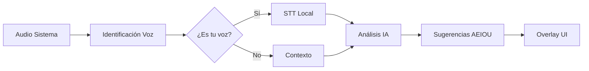

# 🎯 AI Meeting Assistant Lean

> **Asistente de IA para reuniones 100% local, enfocado en privacidad y comunicación no-violenta usando el framework AEIOU**

[](https://www.python.org/downloads/)
[](LICENSE)
[](#roadmap)
[](#características-principales)

## 🌟 Características Principales

- **🔒 100% Local y Privado**: Todo funciona offline, sin APIs externas
- **🎤 Reconocimiento de Voz Personal**: Diferencia automáticamente tu voz de otros participantes
- **💬 Framework AEIOU**: Sugerencias especializadas en comunicación no-violenta
- **⚡ Sin GPU Requerida**: Optimizado para CPUs estándar (4GB RAM)
- **🚀 Desarrollo Lean**: MVP en 4 semanas, arquitectura simple y efectiva
- **💰 Costo Cero**: Sin suscripciones, sin APIs pagadas, compra única

## 🎯 Propuesta de Valor

**El primer asistente de IA que:**
- Escucha todas las reuniones sin necesidad de integrarse a plataformas específicas
- Identifica tu perfil de voz pregrabado para diferenciarte de otros hablantes
- Genera sugerencias en tiempo real usando el framework AEIOU para comunicación constructiva
- Funciona completamente offline preservando tu privacidad total

## 🏗️ Arquitectura Técnica



### Stack Tecnológico

| Componente | Tecnología | Tamaño | Propósito |
|------------|------------|---------|-----------|
| **Audio Capture** | `sounddevice` + `numpy` | ~10MB | Captura audio del sistema |
| **Speaker ID** | `resemblyzer` | ~50MB | Identificación de voz personal |
| **STT** | `whisper.cpp` | ~300MB | Transcripción local |
| **IA** | `ollama` + `Qwen 2.5 0.5B` | ~1GB | Generación de sugerencias |
| **UI** | `tkinter` / `PyQt6` | Built-in | Overlay system-wide |

## 🚀 Roadmap de Desarrollo

### 📅 Semana 1: Audio Foundation
- [x] Setup del repositorio y estructura inicial
- [ ] Implementar captura de audio del sistema (WASAPI/Core Audio)
- [ ] Integrar Resemblyzer para embeddings de voz
- [ ] Sistema de calibración/entrenamiento de perfil personal
- [ ] Testing básico de identificación de speaker

**Entregable:** App que identifica tu voz vs otros en tiempo real

### 📅 Semana 2: STT + IA Local
- [ ] Integrar Whisper.cpp para transcripción local
- [ ] Setup Ollama con Qwen 2.5 0.5B
- [ ] Pipeline de procesamiento en tiempo real
- [ ] Manejo de buffers y optimización de latencia

**Entregable:** Transcripción en tiempo real diferenciando hablantes

### 📅 Semana 3: AEIOU Intelligence
- [ ] Prompts especializados para detectar tensión/conflicto
- [ ] Implementar framework AEIOU en el modelo
- [ ] Lógica de cuándo mostrar sugerencias
- [ ] Context management para conversaciones

**Entregable:** Sugerencias AEIOU relevantes al contexto

### 📅 Semana 4: UI + Packaging
- [ ] Overlay system-wide con transparencia
- [ ] UX/UI para mostrar sugerencias
- [ ] Packaging con PyInstaller para distribución
- [ ] Testing y optimización de performance

**Entregable:** Aplicación instalable y lista para uso

## 🔧 Instalación y Setup

### Requerimientos del Sistema

- **Sistema Operativo:** Windows 10+, macOS 10.15+, Ubuntu 20.04+
- **RAM:** 4GB mínimo (recomendado 8GB)
- **CPU:** Intel i5 2018+ o AMD Ryzen 5 equivalente
- **Almacenamiento:** 2GB espacio libre
- **Audio:** Dispositivo de audio activo

### Instalación para Desarrollo

```bash
# Clonar el repositorio
git clone https://github.com/reyer3/ai-meeting-assistant-lean.git
cd ai-meeting-assistant-lean

# Crear entorno virtual
python -m venv venv
source venv/bin/activate  # Linux/Mac
# o
venv\Scripts\activate  # Windows

# Instalar dependencias
pip install -r requirements.txt

# Setup inicial (descarga modelos)
python setup.py install_models
```

### Primera Configuración

```bash
# Crear perfil de voz personal (una sola vez)
python src/voice_profile_setup.py

# Ejecutar la aplicación
python src/main.py
```

## 🧠 Framework AEIOU

El sistema está especializado en el framework AEIOU para comunicación no-violenta:

- **A (Acknowledge)**: Reconoce la perspectiva del otro
- **E (Express)**: Expresa tu posición con "yo siento/pienso"
- **I (Identify)**: Propón una solución específica
- **O (Outcome)**: Define el resultado deseado para todos
- **U (Understanding)**: Busca comprensión mutua

### Ejemplo de Sugerencia

**Contexto detectado:** Tensión en la conversación
**Último comentario:** "No estás entendiendo el punto principal del proyecto"

**Sugerencia AEIOU generada:**
```
💡 "Entiendo que sientes que no estoy captando algo importante (A). 
Yo percibo que hay diferentes perspectivas sobre el enfoque (E). 
¿Podrías ayudarme a entender específicamente qué aspecto te preocupa más? (I)
Mi objetivo es que ambos estemos alineados en la dirección del proyecto (O).
¿Qué información adicional necesitas de mi parte? (U)"
```

## 📊 Performance Targets

| Métrica | Target | Medición |
|---------|--------|----------|
| Identificación de voz | <100ms | Tiempo de embedding |
| Transcripción (3s audio) | <2s | Whisper processing |
| Generación IA | <3s | Respuesta AEIOU |
| **Latency total** | **<5s** | Audio → Sugerencia |

## 🔒 Privacidad y Seguridad

### Principios de Privacidad
- **Zero Cloud**: Ningún dato sale del dispositivo
- **Perfil Local**: Tu voz queda encriptada localmente
- **Sin Telemetría**: No recopilamos estadísticas de uso
- **Open Source**: Código auditable y transparente

### Datos Almacenados Localmente
- Perfil de voz personal (50KB encriptado)
- Configuraciones de la aplicación
- Logs temporales de debugging (opcional)

## 🛠️ Estructura del Proyecto

```
ai-meeting-assistant-lean/
├── src/
│   ├── audio/
│   │   ├── capture.py          # Captura audio del sistema
│   │   └── speaker_id.py       # Identificación de voz
│   ├── ai/
│   │   ├── stt.py             # Speech-to-text local
│   │   ├── llm.py             # Modelo de IA local
│   │   └── aeiou.py           # Framework AEIOU
│   ├── ui/
│   │   ├── overlay.py         # Overlay system-wide
│   │   └── settings.py        # Configuraciones
│   ├── core/
│   │   ├── pipeline.py        # Pipeline principal
│   │   └── config.py          # Configuración global
│   └── main.py                # Punto de entrada
├── models/                    # Modelos IA locales
├── tests/                     # Tests unitarios
├── docs/                      # Documentación
├── requirements.txt           # Dependencias Python
├── setup.py                   # Script de instalación
└── README.md                  # Este archivo
```

## 🤝 Contribuir al Proyecto

### Áreas donde Necesitamos Ayuda

- **🎤 Audio Processing**: Optimización de captura y filtrado
- **🧠 AI Prompting**: Mejora de prompts para AEIOU
- **🎨 UI/UX**: Diseño de overlay no-intrusivo
- **🧪 Testing**: Testing en diferentes sistemas operativos
- **📚 Documentación**: Guías de usuario y técnicas

### Cómo Contribuir

1. Fork el proyecto
2. Crea una branch para tu feature (`git checkout -b feature/AmazingFeature`)
3. Commit tus cambios (`git commit -m 'Add some AmazingFeature'`)
4. Push a la branch (`git push origin feature/AmazingFeature`)
5. Abre un Pull Request

### Desarrollo Local

```bash
# Instalar dependencias de desarrollo
pip install -r requirements-dev.txt

# Ejecutar tests
pytest tests/

# Linting
flake8 src/
black src/

# Type checking
mypy src/
```

## 📈 Métricas de Éxito

- **Precisión Speaker ID**: >90% en condiciones normales
- **Latencia Total**: <5 segundos audio → sugerencia
- **Memoria Usage**: <2GB durante operación
- **CPU Usage**: <30% en CPU promedio
- **Uptime**: >99% sin crashes durante 8 horas uso

## 🆚 Comparación con Competidores

| Feature | Este Proyecto | Otter.ai | Grain | Fireflies |
|---------|---------------|----------|--------|-----------|
| **100% Local** | ✅ | ❌ | ❌ | ❌ |
| **Sin Suscripción** | ✅ | ❌ | ❌ | ❌ |
| **Speaker Recognition** | ✅ | ✅ | ✅ | ✅ |
| **AEIOU Framework** | ✅ | ❌ | ❌ | ❌ |
| **Tiempo Real** | ✅ | ✅ | ❌ | ❌ |
| **Sin Integraciones** | ✅ | ❌ | ❌ | ❌ |

## 📋 TODO

### Próximas Features
- [ ] Soporte para múltiples idiomas
- [ ] Exportar sugerencias a PDF/texto
- [ ] Integración con calendarios para contexto
- [ ] Modo "presentación" (solo escucha)
- [ ] Dashboard de métricas de comunicación
- [ ] Plugin para Obsidian/Notion

### Optimizaciones Técnicas
- [ ] Cuantización INT8 para modelos más rápidos
- [ ] GPU acceleration opcional (CUDA/Metal)
- [ ] Streaming processing para latencia ultra-baja
- [ ] Cache inteligente de embeddings

## 📜 Licencia

Este proyecto está bajo la Licencia MIT - ver el archivo [LICENSE](LICENSE) para detalles.

## 🙏 Agradecimientos

- **OpenAI Whisper** - STT de alta calidad
- **Resemblyzer** - Embeddings de voz eficientes  
- **Ollama** - Runtime local para LLMs
- **AEIOU Framework** - Metodología de comunicación no-violenta

## 📞 Contacto

- **GitHub Issues**: Para bugs y feature requests
- **GitHub Discussions**: Para preguntas y ideas
- **Email**: [tu-email] (para temas privados)

---

**⭐ Si este proyecto te resulta útil, considera darle una estrella en GitHub!**

---

*Desarrollado con ❤️ para mejorar la comunicación en equipos de trabajo*